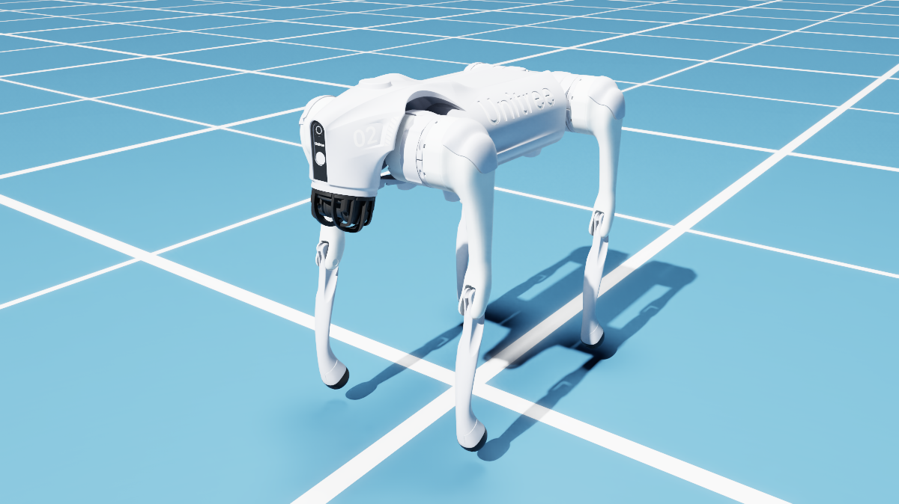
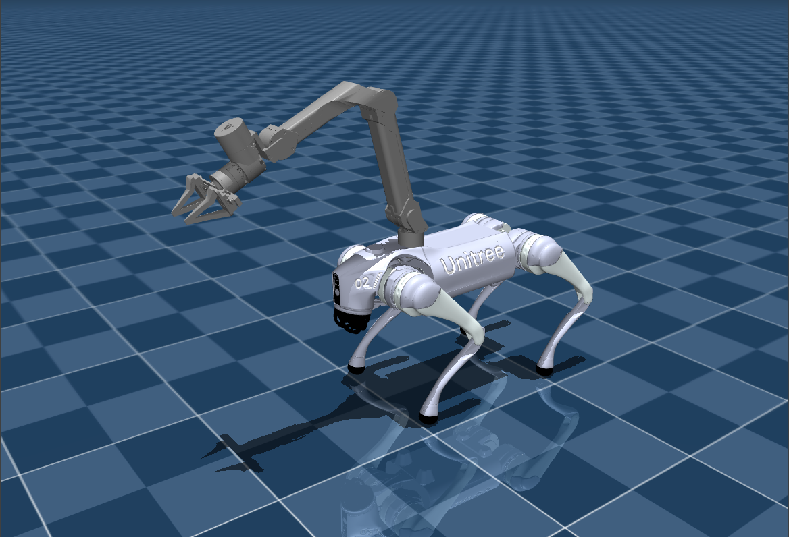

# Go2-X5-lab

`Go2-X5-lab` is an Isaac Lab extension for Unitree Go2 and the Go2-X5 mobile manipulation platform. It contains locomotion tasks, Go2-X5 training routes, DogOnly low-level PPO control, UMI-style locomotion prototypes, and early tabletop / door manipulation task scaffolds.

| Go2 | Go2-X5 |
| --- | --- |
|  |  |
| Quadruped velocity tracking | Quadruped base with X5 arm |

## Current Scope

- Go2 flat / rough velocity tracking with RSL-RL and optional CusRL entrypoints.
- Go2-X5 locomotion on flat and rough terrain.
- Go2-X5 DogOnly PPO: the policy outputs 12 leg actions; arm and gripper commands stay outside the PPO action head.
- Training-stage records for foundation flat, rough transfer, and arm warmup.
- UMI-style 18-DoF locomotion6D prototype environments.
- Prototype tabletop reach and door-opening ManagerBased tasks with high-level `cmd_vel(3) + arm_joint_pos(6) + gripper(1)` action contracts.
- VLA-SFT scene usage and visualization utilities.

## Repository Layout

| Path | Purpose |
| --- | --- |
| `source/robot_lab/robot_lab/assets` | Robot asset configuration for Go2 and Go2-X5. |
| `source/robot_lab/robot_lab/tasks/manager_based/locomotion/velocity` | ManagerBased locomotion environments, MDP terms, and task registration. |
| `source/robot_lab/robot_lab/tasks/manager_based/manipulation` | Ground-pick, VLA-SFT, tabletop, and door manipulation task code. |
| `scripts/reinforcement_learning/rsl_rl` | RSL-RL train / play entrypoints. |
| `scripts/reinforcement_learning/cusrl` | Optional CusRL train / play entrypoints. |
| `scripts/maintenance` | Environment listing and cleanup helpers. |
| `scripts/assets` | Asset conversion and render asset download helpers. |
| `scripts/checkpoints` | Checkpoint migration helpers. |
| `scripts/control` | Keyboard control scripts. |
| `scripts/visualization` | Camera, ground-pick, and VLA-SFT visualization scripts. |
| `docs/user` | Developer-facing setup, framework, training, replay, camera, keyboard, and VLA-SFT guides. |
| `docs/train` | Local training reward / weight records. This directory is intentionally ignored by git. |
| `docs/history` | Local expired notes and non-current training routes. Each file starts with an expiry notice. |

The full documentation map is in [docs/README.md](docs/README.md).
The script directory index is in `scripts/INDEX`.

## Environment

Recommended base stack:

- Python `3.11`
- Isaac Sim `5.1.0`
- Isaac Lab `2.3.0`
- CUDA-capable PyTorch stack compatible with the Isaac Lab environment

Install the local extension:

```bash
python -m pip install -r requirements.txt
python -m pip install -e source/robot_lab
```

Optional CusRL support:

```bash
python -m pip install -e "source/robot_lab[cusrl]"
```

Detailed setup is in [docs/user/environment.md](docs/user/environment.md).

## Main Task IDs

| Group | Task IDs |
| --- | --- |
| Go2 locomotion | `RobotLab-Isaac-Velocity-Flat-Unitree-Go2-v0`, `RobotLab-Isaac-Velocity-Rough-Unitree-Go2-v0` |
| Go2-X5 baseline | `RobotLab-Isaac-Velocity-Flat-Go2-X5-v0`, `RobotLab-Isaac-Velocity-Rough-Go2-X5-v0` |
| Go2-X5 staged training | `RobotLab-Isaac-Velocity-Flat-Go2-X5-Foundation-v0`, `RobotLab-Isaac-Velocity-Rough-Go2-X5-Robust-v0`, `RobotLab-Isaac-Velocity-Rough-Go2-X5-ArmWarmup-v0` |
| Go2-X5 DogOnly | `RobotLab-Isaac-Velocity-Flat-Go2-X5-DogOnly-v0`, `RobotLab-Isaac-Velocity-Flat-Go2-X5-DogOnlyArm-v0`, `RobotLab-Isaac-Velocity-Flat-Go2-X5-DogOnlyRecover-v0`, `RobotLab-Isaac-Velocity-Rough-Go2-X5-DogOnly-v0` |
| UMI prototypes | `RobotLab-Isaac-Velocity-Flat-Go2-X5-UMI-Locomotion6D-v0`, `RobotLab-Isaac-Velocity-Rough-Go2-X5-UMI-Extreme-Locomotion6D-v0` |
| Manipulation prototypes | `RobotLab-Isaac-GroundPick-Go2-X5-v0`, `RobotLab-Isaac-Go2-X5-Tabletop-Reach-v0`, `RobotLab-Isaac-Go2-X5-Door-v0` |

Check local registration:

```bash
python scripts/maintenance/list_envs.py
```

## Training

Foundation flat:

```bash
python scripts/reinforcement_learning/rsl_rl/train.py \
  --task=RobotLab-Isaac-Velocity-Flat-Go2-X5-Foundation-v0 \
  --headless
```

Rough transfer from a foundation checkpoint:

```bash
python scripts/reinforcement_learning/rsl_rl/train.py \
  --task=RobotLab-Isaac-Velocity-Rough-Go2-X5-Robust-v0 \
  --headless \
  --resume \
  --checkpoint=logs/rsl_rl/go2_x5_foundation_flat/<run>/model_<iter>.pt
```

DogOnly rough curriculum continuation from a flat DogOnly checkpoint:

```bash
python scripts/reinforcement_learning/rsl_rl/train.py \
  --task=RobotLab-Isaac-Velocity-Rough-Go2-X5-DogOnly-v0 \
  --headless \
  --resume \
  --checkpoint=logs/rsl_rl/go2_x5_dog_only_flat/2026-04-18_18-46-33_dog_only_recover_from15000/model_18250.pt
```

Reward and weight records are kept locally under `docs/train`.

## Replay

```bash
python scripts/reinforcement_learning/rsl_rl/play.py \
  --task=RobotLab-Isaac-Velocity-Flat-Go2-X5-Foundation-v0 \
  --checkpoint=logs/rsl_rl/go2_x5_foundation_flat/<run>/model_<iter>.pt \
  --num_envs=1
```

Keyboard-controlled single-robot replay:

```bash
python scripts/reinforcement_learning/rsl_rl/play.py \
  --task=RobotLab-Isaac-Velocity-Flat-Go2-X5-Foundation-v0 \
  --checkpoint=logs/rsl_rl/go2_x5_foundation_flat/<run>/model_<iter>.pt \
  --num_envs=1 \
  --keyboard
```

More examples are in [docs/user/training_and_replay.md](docs/user/training_and_replay.md).

## Documentation Policy

Root-level documentation is limited to:

- `README.md`: project overview.
- `requirements.txt`: Python dependency notes.

Current pushable project docs live in `docs/user`.

Training records and expired local notes live in ignored documentation stores.
